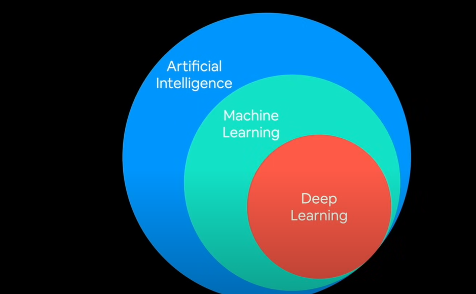
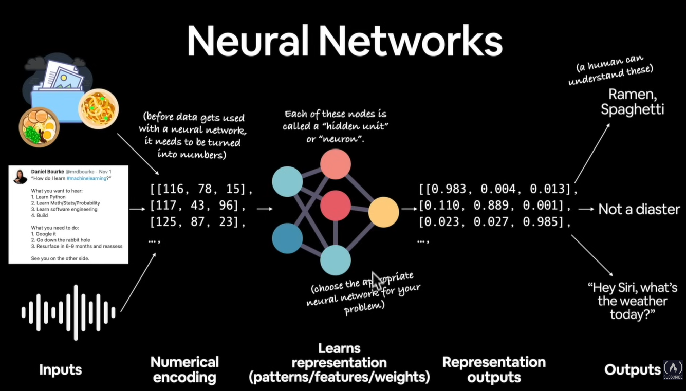
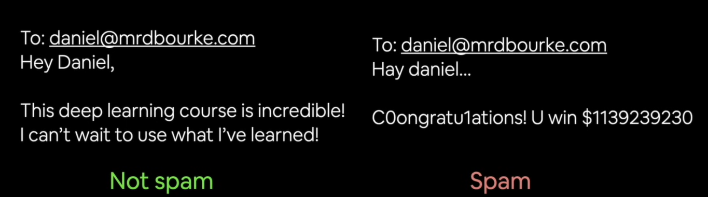

<div
style="
font-family: Arial, sans-serif;
"
>

# Welcome to Deep Learning with PyTorch 
# Table of Contents
 <table>
    <tr>
      <td>1. <a href="#what-is-deep-learning" style="color: inherit; text-decoration: none;">What is Deep Learning?</a></td>
    </tr>
    <tr>
      <td>2. <a href="#why-use-machine-learning-or-deep-learning" style="color: inherit; text-decoration: none;">Why use Machine Learning or Deep Learning?</a></td>
    </tr>
    <tr>
      <td>3. <a href="#when-should-you-use-deep-learning" style="color: inherit; text-decoration: none;">When should you use Deep Learning? 🤖✅</a></td>
    </tr>
    <tr>
      <td>4. <a href="#what-deep-learning-is-typically-not-good-for-" style="color: inherit; text-decoration: none;">What deep learning is <span style="font-family: cursive; font-weight: 700;">(typically)</span> not good for? 🤖❌</a></td>
    </tr>
    <tr>
      <td>5. <a href="#machine-learning-vs-deep-learning" style="color: inherit; text-decoration: none;">Machine Learning vs Deep Learning</a></td>
    </tr>
    <tr>
      <td>6. <a href="#common-algorithms" style="color: inherit; text-decoration: none;">Common Algorithms</a></td>
    </tr>
    <tr>
      <td>7. <a href="#how-does-a-neural-network-procesess-data" style="color: inherit; text-decoration: none;">How does a Neural Network process data?</a></td>
    </tr>
    <tr>
      <td>8. <a href="#anatomy-of-a-neural-network" style="color: inherit; text-decoration: none;">Anatomy of a Neural Network</a></td>
    </tr>
    <tr>
    <td>9. <a href="#types-of-learning"style="color: inherit; text-decoration: none;">Types of learning</a>
    <ul>
    <li><a href="#supervised-learning">Supervised Learning</a></li>
    <li><a href="#unsupervised-learning">Unsupervised Learning</a></li>
    <li><a href="#transfer-learning">Transfer Learning</a></li>
    </ul></td></tr>
    <tr>
    <td>
    10. <a href="#what-is-deep-learning-actually-used-for"style="color: inherit; text-decoration: none;">What is Deep Learning actually used for?</a>
    <ul>
    <li><a href="#some-deep-learning-use-cases"><span style="font-family: cursive;">(some)</span> Deep learning use cases</li>
    </td>
    </tr>

  </table>

# What is Deep Learning?


# Why use Machine Learning or Deep Learning?


Like take driving for example, can you list out every rule about driving, there are thousands if not hundreds of thousands of rules, can you list all of them out in a simple rule based system?<br> <br> <br>


# When should you use Deep Learning?🤖✅
- **Problems with long lists of rules** --when traditional programming fails, machine learning/deep learning may help.

- **Continuosly changing environments** --deep learning can adapt('learn') to new scenarios.

- **Discovering insights in large collections of data** --can you imagine trying to hand-craft rules for what 101 different foods look like? Like how do you tell a computer what a banana looks like? also you have to tell it everything that isn't a banana.

# What deep learning is <span style="font-family:cursive; font-weight:700;">(typically)</span> not good for? 🤖❌
- **When you need explainability** --the patterns learned by a deep learning model are typically uninterpretable by humans.

- **When traditional approach is a better option** --if you can accomplish what you need with a simple rule-based system.

- **When errors are unacceptable** --since the outputs of deep learning models are not always predictable. 

- **When you don't have much data** -- deep learning models <span style="font-family:cursive; font-weight:700;">(typically)</span> require a lot of data to produce great results.

# Machine learning vs Deep Learning
**Machine learning** models are <span style="font-family:cursive; font-weight:700;">(typically)</span> used on **structured data** 
while **deep learning** models are <span style="font-family:cursive; font-weight:700;">(typically)</span> used on **unstructured data**

### Examples of Structured data
- Rows and columns

### Example of unstructured data
- Natural language
- Images
- Voice

## Common algorithms
### Machine learning 
- Random forest
- Gradient boosted models
- Native Bayes
- Nearest neighbour
- Support vector machines (SVMs)
- ...many more
<p style="font-family:cursive; rotate:3deg;">(since the advent of deep learning<br> these are refered to as 'shallow algorithms') </p>

### Deep learning
<div
style="
background-color: #4d9b93;
border-radius: 5px;
padding: 5px;
color: #000;
"
>
- Neural networks<br>
- Fully connected neural networks<br>
- Convolutional neural networks<br>
</div>
<span style="font-family: cursive; font-size: 20px"><span style="font-weight:600; font-size:30px">(&uarr;</span> what we'll build with PyTorch)<br></span>
- Recurrent neural networks<br>
- Transformer <br>
- ...many more<br>
<br>

# How does a neural network procesess data?

<a src="https://youtu.be/V_xro1bcAuA?si=EnzdaQqpIT1Cbue4&t=1736"style="font-size:8px;">SOURCE: PyTorch for Deep Learning & Machine Learning – Full Course | freeCodeCamp  </a>

# Anatomy of a neural network
- Input data goes into the input layer.
- Processing is done in the hidden layer.
- Output data out of the output layer.

<p style="font-family: cursive;">Each layer is usually a combination of <span style="color: seagreen;">linear (straight line)</span> and/or <span style="color:blue">non-linear(non-straight line) </span>functions.</p>

#### NOTE
```patterns``` is an arbitary term, you will often hear ```embedding```, ```weights```, ```feature representation```, ```featured vector``` representing the same thing.

# Types of learning


## Supervised learning
The type of learning where we have labels with data points is called ```Supervised learning```. 
## Unsupervised learning (and self supervised learning)
The type of learning where we don't have labels with data points and we want the algorithm to figure out itself is called ```Unsupervised learning```
## Transfer learning
The type of learning where we take the patterns learnt by 1 model to another model to give it sort of a head start.
### we will mainly be focusing on supervised learning and transfer learning for this course. 
### One that isn't mentioned here is ```Reinforcement learning```
You can check these references for that:

- <a href="https://en.wikipedia.org/wiki/Reinforcement_learning" target="_blank">Wikipedia - Reinforcement Learning</a>
 - <a href="https://www.ibm.com/topics/reinforcement-learning" target="_blank">IBM - Reinforcement Learning </a>
 - 
 
 
 -
 


# What is deep learning actually used for?
## <span style="font-family: cursive;">(some)</span> Deep learning use cases
- Recommendation on websites like YouTube are powered by Deep Learning.
- Translation 
- Speech recognition
- Computer Vision
- Natural Language processing (NLP)

</div>