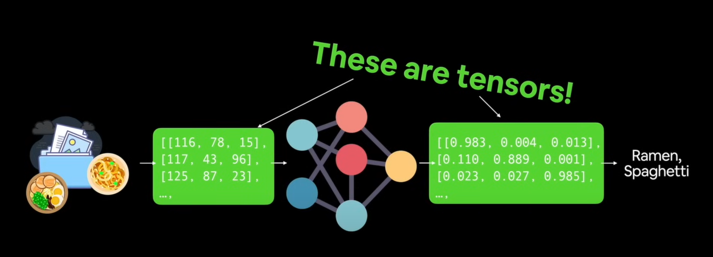
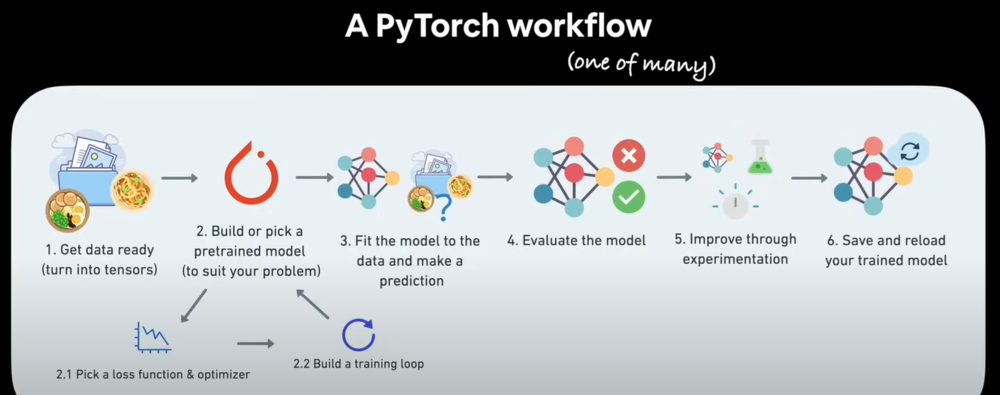
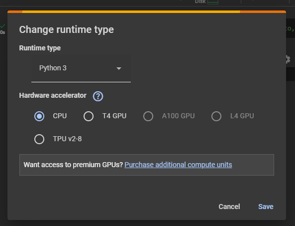

# Table of Contents
<table>

<tr>
<td>
1. <a href="#what-is-and-why-use-pytorch">What is and why use Pytorch?</a>
<ul>
<li>
<a href="#what-is-pytorch">What is PyTorch?</a>
<a href="#why-pytorch">Why PyTorch?</a>
</li>
<li>
<a href="#what-is-a-gputpu">What is a GPU/TPU </a>
</li>
</ul>
</td>
</tr>

<tr>
<td>
2. <a href="#what-is-a-tensor">What is a tensor?</a>
</td>
</tr>

<tr>
<td>
3. <a href="#getting-started-by-writing-code-">Getting Started by writing code 🥳🥳 </a>
</td> 
</tr>


</table>


# What is and why use PyTorch?

## What is PyTorch?

- It is the most popular Deep Learning framework.
- Write fast Deep Learning code in Python (able to run on a GPU/many GPUs).
- Able to access many pre-built deep learning models (Torch Hub/```torchvision.org```).
- Whole stack: pre-process data, model data, deploy model in your application or the cloud.
- Originally designed to be used in-house by Facebook/Meta (now open-source and used by companies such as Tesla, Microsoft, OpenAI).

#### You can also see what frameworks are popular in the industry here: [Papers with Code](https://paperswithcode.com/trends).

## Why PyTorch?
- Its reseach favourite.

As of September 2024 PyTorch is used in 57% of repos tracked by Papers with Code. So out of 145,716, 57% which is approximatly 83058 repos use PyTorch.

- Its used everywhere.


Here are some places where PyTorch is used:
<ul>
<li>

[PyTorch at Tesla](https://youtu.be/oBklltKXtDE?si=eSPRdvlDpSAKuAM9)
</li>
<li>

[PyTorch in Agriculture](https://medium.com/pytorch/ai-for-ag-production-machine-learning-for-agriculture-e8cfdb9849a1)
</li>
<li>

[PyTorch at OpenAI](https://openai.com/index/openai-pytorch/)
</li>
<li>

[PyTorch at Facebook/Meta](https://ai.meta.com/tools/pytorch/)
</li>
<li>
There are a lot more like Apple, Microsoft etc. but these are some I found interesting.
</li>
</ul>

## What is a GPU/TPU?
### GPU
A GPU (Graphics processing unit) is very good at rendering graphics and numbers, traditionally used in gaming but now used for Ai.

### TPU
A TPU (Tensor Processing Unit) is good, but we will primarily focus on writing GPU focused PyTorch code for the scope of this course because they are far more common than TPUs. 

Now we discussed about Tensor Processing units, but...
# What is a tensor?
It can be any representation of numbers. we'll focus on them as they are the fundamental building block of PyTorch other than Neural networks.



# What we're going to cover? (code wise)

<br> <br>
 
# Getting Started by writing code 🥳🥳
The main tool we will be using is ***Google Colab***.

## Opening Google Colab
- Go to your browser and go [colab.research.google.com](https://colab.research.google.com/)

## Following along
- If you want the code I write for this module you can access my Colab Notebook [here](https://colab.research.google.com/drive/1S1ZtNhWYkWuV5qNo833XgLDlZxkVqnaJ?usp=sharing).

### Changing runtime type in Google Colab
- In Google Colab, click on Runtime.
- Then 'Change runtime type'.
- A window similar to the following should appear:


#### Rest of the notes may be in the Colab Notebook